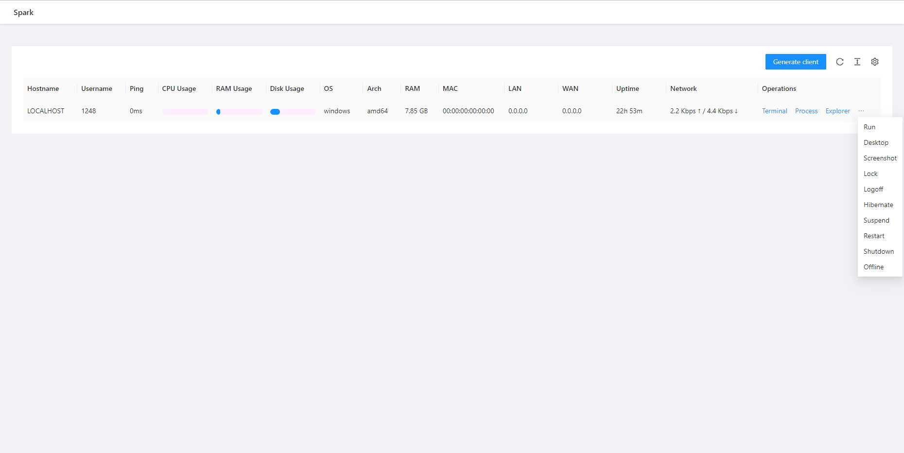
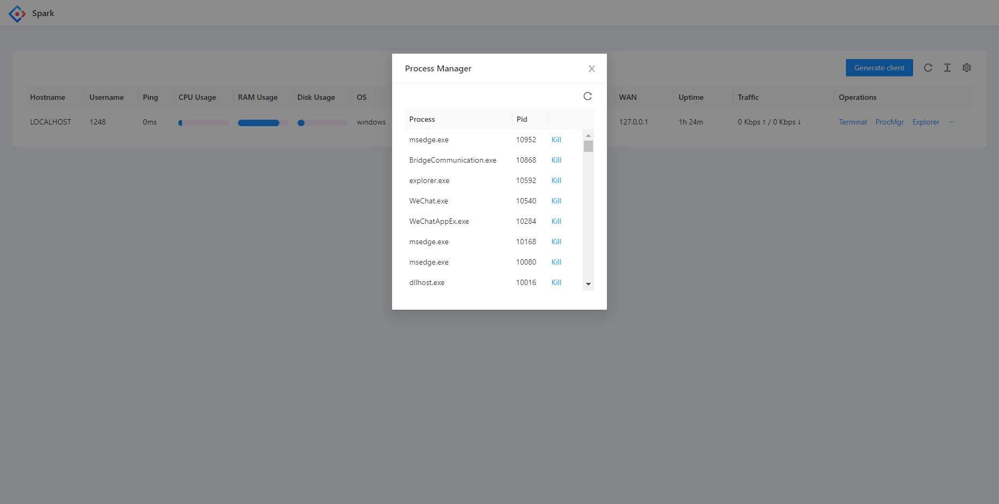

<h1 align="center">Spark</h1>

**Spark** is a free, safe, open-source, web-based, cross-platform and full-featured RAT (Remote Administration Tool)
that allow you to control all your devices via browser anywhere.

### [English] [[中文]](./README.ZH.md)

---

## **Quick start**

Only local installation are available yet.

<details>
<summary>Local installation:</summary>

* Get prebuilt executable file from [Releases](https://github.com/XZB-1248/Spark/releases) page.
* Modify configuration file and set your own salt.

  ```json
  {
	  "listen": ":8000",
	  "salt": "some random string",
	  "auth": {
		  "username": "password"
	  }
  }
  ```

* Run it and browser the address:port you've just set.
* Generate client online and execute it on your device.
* Now you can control your device.

</details>

---

## **Features**

| Feature/OS      | Windows | Linux | MacOS |
|-----------------|---------|-------|-------|
| Process manager | ✔       | ✔     | ✔     |
| Kill process    | ✔       | ✔     | ✔     |
| File explorer   | ✔       | ✔     | ✔     |
| File transfer   | ✔       | ✔     | ✔     |
| Delete file     | ✔       | ✔     | ✔     |
| OS info         | ✔       | ✔     | ✔     |
| Shell           | ✔       | ✔     | ✔     |
| Screenshot      | ✔       | ✔     | ✔     |
| Shutdown        | ✔       | ✔     | ❌     |
| Reboot          | ✔       | ✔     | ❌     |
| Hibernate       | ✔       |       | ❌     |
| Sleep           | ✔       |       | ❌     |
| Log off         | ✔       | ❌     | ❌     |
| Lock screen     | ✔       | ❌     | ❌     |

* Blank cell means the situation is not tested yet.

---

## **Development**

### note

There are three components in this project, so you have to build them all.

Go to [Quick start](#quick-start) if you don't want to make yourself boring.

* Client
* Server
* Front-end

If you want to make client support OS except linux and windows, you should install some additional C compiler.

For example, to support android, you have to install [Android NDK](https://developer.android.com/ndk/downloads).

### tutorial

```bash
# Clone this repository
$ git clone https://github.com/XZB-1248/Spark


$ cd ./Spark


# Here we're going to build front-end pages.
$ cd ./web
# Install all dependencies and build.
$ npm install
$ npm run build-prod


# Embed all static resources into one single file by using statik.
$ cd ..
$ go install github.com/rakyll/statik
$ statik -m -src="./web/dist" -f -dest="./server/embed" -p web -ns web


# Now we should build client.
$ mkdir ./built
# Use this when you're using windows.
$ ./build.client.bat

# When you're using unix-like OS, you can use this.
$ ./build.client.sh


# Finally we're compiling the server side.
$ go build -ldflags "-s -w" -o Spark Spark/Server

```

---

## Screenshots







---

## Dependencies

Spark contains many third-party open-source projects.

Lists of dependencies can be found at `go.mod` and `package.json`.

Some major dependencies are listed below.

### Back-end

* [Go](https://github.com/golang/go) ([License](https://github.com/golang/go/blob/master/LICENSE))

* [gin-gonic/gin](https://github.com/gin-gonic/gin) (MIT License)

* [imroc/req](https://github.com/imroc/req) (MIT License)

* [kbinani/screenshot](https://github.com/kbinani/screenshot) (MIT License)

* [shirou/gopsutil](https://github.com/shirou/gopsutil) ([License](https://github.com/shirou/gopsutil/blob/master/LICENSE))

* [gorilla/websocket](https://github.com/gorilla/websocket) (BSD-2-Clause License)

* [orcaman/concurrent-map](https://github.com/orcaman/concurrent-map) (MIT License)

### Front-end

* [React](https://github.com/facebook/react) (MIT License)

* [Ant-Design](https://github.com/ant-design/ant-design) (MIT License)

* [axios](https://github.com/axios/axios) (MIT License)

* [xterm.js](https://github.com/xtermjs/xterm.js) (MIT License)

* [crypto-js](https://github.com/brix/crypto-js) (MIT License)

---

## License

[BSD-2 License](./LICENSE)